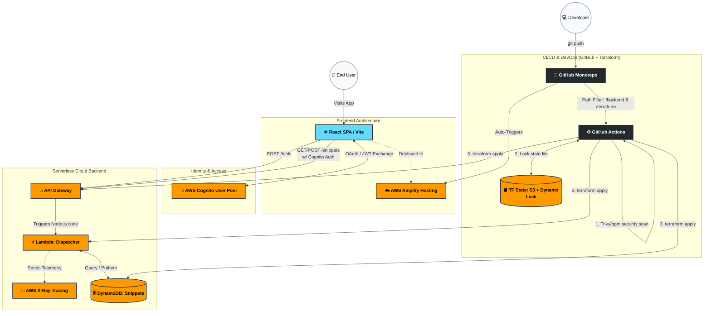

```mermaid
graph TD
    %% Define global styling
    classDef aws fill:#FF9900,stroke:#232F3E,stroke-width:2px,color:black,font-weight:bold;
    classDef git fill:#24292e,stroke:#ffffff,stroke-width:2px,color:white,font-weight:bold;
    classDef react fill:#61DAFB,stroke:#20232A,stroke-width:2px,color:black,font-weight:bold;
    classDef actor fill:#f8fafc,stroke:#94a3b8,stroke-width:2px,color:black;

    User((👤 End User)):::actor
    Dev((💻 Developer)):::actor

    subgraph "Frontend Architecture"
        UI[⚛️ React SPA / Vite]:::react
        Amplify[☁️ AWS Amplify Hosting]:::aws
        UI -.->|Deployed to| Amplify
    end

    subgraph "Identity & Access"
        Cognito[🔑 AWS Cognito User Pool]:::aws
    end

    subgraph "Serverless Cloud Backend"
        API[🚪 API Gateway]:::aws
        Lambda[⚡ Lambda: Dispatcher]:::aws
        XRay[📡 AWS X-Ray Tracing]:::aws
        DB[(🗄️ DynamoDB: Snippets)]:::aws
    end

    subgraph "CI/CD & DevOps (GitHub + Terraform)"
        Repo[🐙 GitHub Monorepo]:::git
        GHA[⚙️ GitHub Actions]:::git
        TFState[(🪣 TF State: S3 + Dynamo Lock)]:::aws
    end

    %% --- User Application Flow ---
    User -->|Visits App| UI
    UI <-->|OAuth / JWT Exchange| Cognito
    UI -->|POST /tools| API
    UI -->|GET/POST /snippets <br> w/ Cognito Auth| API
    API -->|Triggers Node.js code| Lambda
    Lambda -.->|Sends Telemetry| XRay
    Lambda <-->|Query / PutItem| DB

    %% --- Developer CI/CD Flow ---
    Dev -->|git push| Repo
    Repo -->|Auto-Triggers| Amplify
    Repo -->|Path Filter: /backend & /terraform| GHA

    GHA -->|1. Trivy/npm security scan| GHA
    GHA <-->|2. Lock state file| TFState
    GHA -->|3. terraform apply| API
    GHA -->|3. terraform apply| Lambda
    GHA -->|3. terraform apply| DB
```